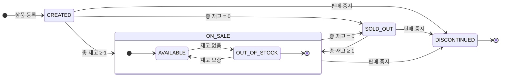
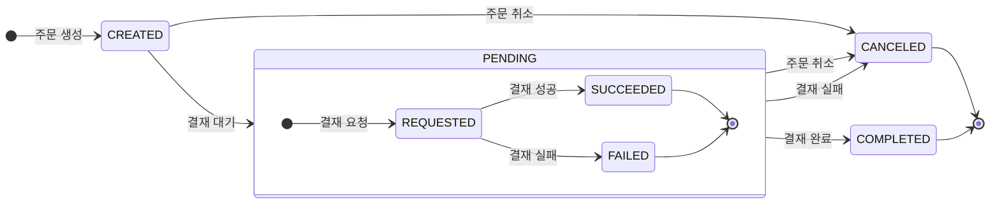
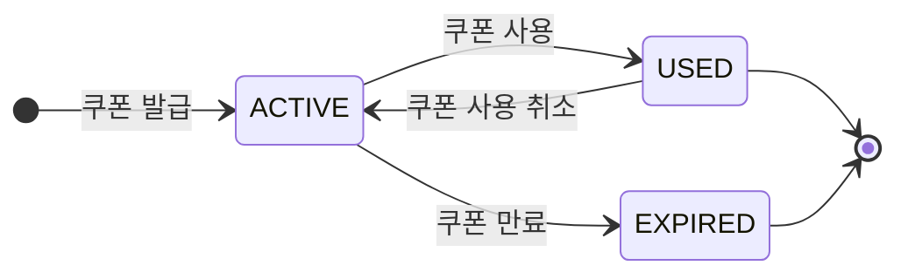

# 🛒 E-Commerce State Diagram

## 📚 상태 다이어그램 (State Diagram)
- [🛍️ 상품 (Products)](#-상품-products)
- [🧾 주문 / 결재 (Orders & Payments)](#-주문--결재-orders--payments)
- [💵 결재 (Payments)](#-결재-payments)
- [🎟️ 쿠폰 (Coupons)](#-쿠폰-coupons)

## 🛍️ 상품 (Products)

### 📝 설명 (Description)
- 상품은 `등록(CREATED)`, `판매중(ON_SALE)`, `품절(SOLD_OUT)`, `판매중지(DISCONTINUED)` 상태를 가집니다.
- `판매중(ON_SALE)` 상태는 다시 `재고있음(AVAILABLE)`과 `재고없음(OUT_OF_STOCK)` 상태로 세분화됩니다.
- 상품은 `총 재고`에 따라 상태가 전이됩니다.
- `판매중지(DISCONTINUED)` 상태는 상품이 더 이상 판매되지 않음을 나타내며, 이 상태에서는 다른 상태로 전이되지 않습니다.
- `판매중지(DISCONTINUED)` 상태의 상품을 재판매 하려면 새로 등록해야 합니다.

## 🧾 주문 / 결재 (Orders & Payments)

### 📝 설명 (Description)
- 주문은 `생성(CREATED)`, `결재 대기(PENDING)`, `결재 완료(COMPLETED)`, `취소(CANCELED)` 상태를 가집니다.
- `결재 대기(PENDING)` 상태는 다시 `결재 요청(REQUESTED)`, `결재 성공(SUCCEEDED)`, `결재 실패(FAILED)` 상태로 세분화됩니다.
- 주문은 `결재 완료(COMPLETED)` 또는 `취소(CANCELED)` 상태로 전이됩니다.
- `취소(CANCELED)` 상태는 주문이 더 이상 진행되지 않음을 나타내며, 이 상태에서는 다른 상태로 전이되지 않습니다.
- `취소(CANCELED)` 상태의 주문을 다시 진행하려면 새로 주문해야 합니다.

## 🎟️ 쿠폰 (Coupons)

### 📝 설명 (Description)
- 쿠폰은 `활성(ACTIVE)`, `사용됨(USED)`, `만료(EXPIRED)` 상태를 가집니다.
- 쿠폰은 `사용됨(USED)` 또는 `만료(EXPIRED)` 상태로 전이됩니다.
- 쿠폰은 발급 시점부터 유효기간이 지나면 자동으로 `만료(EXPIRED)` 상태로 전이됩니다.
- `만료(EXPIRED)` 상태는 쿠폰이 더 이상 사용되지 않음을 나타내며, 이 상태에서는 다른 상태로 전이되지 않습니다.
- `만료(EXPIRED)` 상태의 쿠폰을 다시 사용하려면 새로 발급받아야 합니다. (⚠️ 재발급 정책은 별도 관리)
- `사용됨(USED)` 상태의 쿠폰은 사용 취소 시 다시 `활성(ACTIVE)` 상태로 돌아갈 수 있습니다.
- 쿠폰 사용 취소는 주문이 취소되거나 환불되는 경우에만 가능합니다.
