# 🛒 E-Commerce Sequence Diagram

## 📚 시퀀스 다이어그램 (Sequence Diagram)
- [👤 유저 (Users)](#-유저-users)
- [💰 포인트 (Points)](#-포인트-points)
- [🏷️ 브랜드 (Brands)](#-브랜드-brands)
- [🛍️ 상품 (Products)](#-상품-products)
- [❤️ 좋아요 (Like)](#-좋아요-like)
- [🧾 주문 / 결재 (Orders & Payments)](#-주문--결재-orders--payments)
- [🛒 장바구니 (Cart)](#-장바구니-cart)
- [🎟️ 쿠폰 (Coupons)](#-쿠폰-coupons)

## 👤 유저 (Users)
### 회원가입
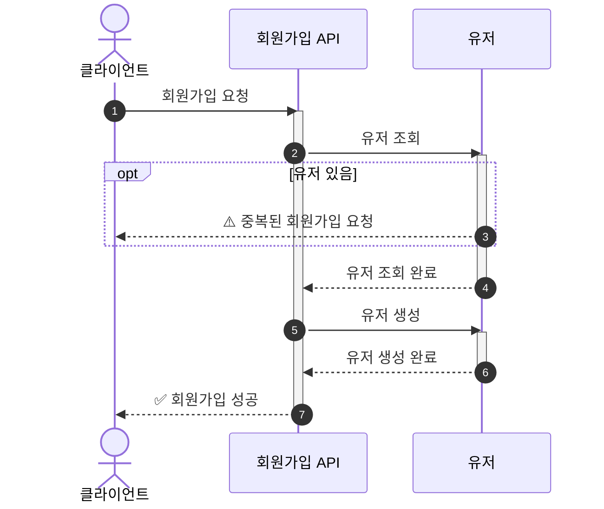
```mermaid
sequenceDiagram
    autonumber
    actor client as 클라이언트
    participant api as 회원가입 API
    participant user as 유저
    
    client->>api: 회원가입 요청
    activate api
    
    api->>user: 유저 조회
    activate user
    
    opt 유저 있음
        user-->>client: ⚠️ 중복된 회원가입 요청
    end
    user-->>api: 유저 조회 완료
    deactivate user
    
    api->>user: 유저 생성
    activate user
    user-->>api: 유저 생성 완료
    deactivate user
    
    api-->>client: ✅ 회원가입 성공
    deactivate api
```
#### 📝 설명 (Description)
- (1) 클라이언트가 회원가입을 요청한다.
- (2) 유저 조회한다.
- (3) 유저가 존재하는 경우, 클라이언트에 `⚠️ 중복된 회원가입 요청`임을 알린다.
- (4)-(7) 유저가 존재하지 않는 경우, 유저 생성하고, 완료되면 클라이언트에 `✅ 회원가입 성공`을 알린다.

### 프로필 조회
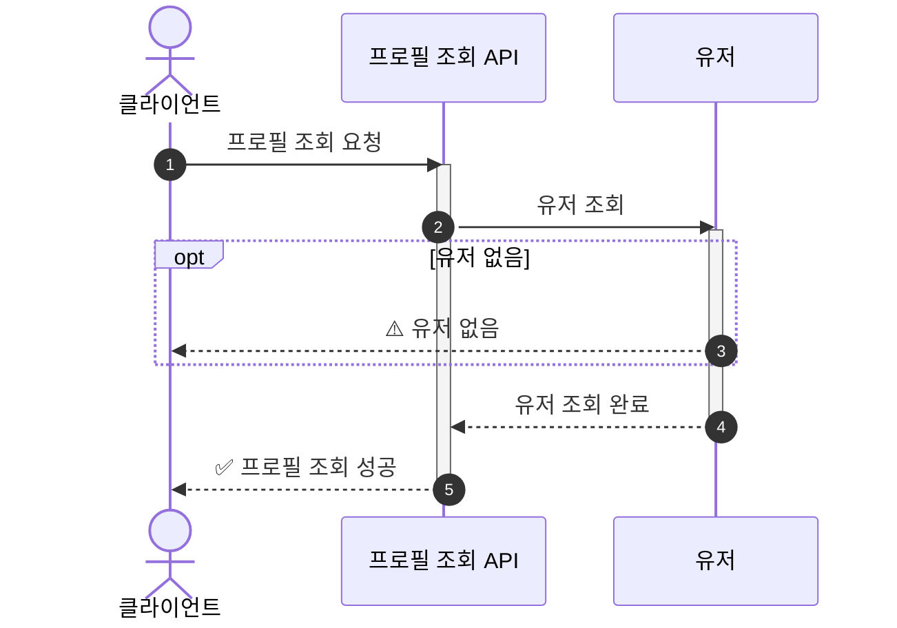
```mermaid
sequenceDiagram
    autonumber
    actor client as 클라이언트
    participant api as 프로필 조회 API
    participant user as 유저
    
    client->>api: 프로필 조회 요청
    activate api
    
    api->>user: 유저 조회
    activate user
    opt 유저 없음
        user-->>client: ⚠️ 유저 없음
    end
    user-->>api: 유저 조회 완료
    deactivate user
    
    api-->>client: ✅ 프로필 조회 성공
    deactivate api
```
#### 📝 설명 (Description)
- (1) 클라이언트가 프로필 조회를 요청한다.
- (2) 유저 조회한다
- (3) 유저가 존재하지 않는 경우, 클라이언트에 `⚠️ 유저 없음` 응답을 보낸다.
- (4)-(5) 유저가 존재하는 경우, 유저 조회가 완료되면 클라이언트에 `✅ 프로필 조회 성공`을 알린다.

## 💰 포인트 (Points)
### 포인트 조회
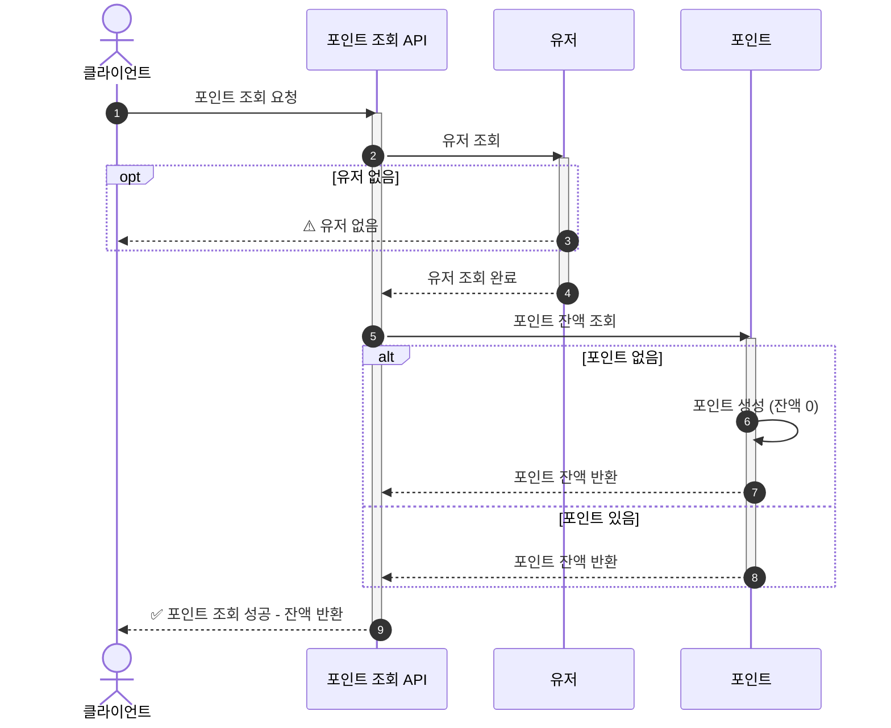
```mermaid
sequenceDiagram
    autonumber
    actor client as 클라이언트
    participant api as 포인트 조회 API
    participant user as 유저
    participant point as 포인트
    
    client->>api: 포인트 조회 요청
    activate api
    
    api->>user: 유저 조회
    activate user
    opt 유저 없음
        user-->>client: ⚠️ 유저 없음
    end
    user-->>api: 유저 조회 완료
    deactivate user
    
    api->>point: 포인트 잔액 조회
    activate point
    alt 포인트 없음
        point->>point: 포인트 생성 (잔액 0)
        point-->>api: 포인트 잔액 반환
    else 포인트 있음
        point-->>api: 포인트 잔액 반환
        deactivate point
    end
    api-->>client: ✅ 포인트 조회 성공 - 잔액 반환
    deactivate api
```
#### 📝 설명 (Description)
- (1) 클라이언트가 포인트 조회를 요청한다.
- (2) 유저 조회를 요청한다.
- (3) 유저가 존재하지 않는 경우, 클라이언트에 `⚠️ 유저 없음` 응답을 보낸다.
- (4)-(5) 유저가 존재하는 경우, 포인트 잔액 조회한다.
- (6) 포인트가 존재하지 않는 경우, 포인트를 생성하고 잔액 0을 반환한다.
- (7) 포인트가 존재하는 경우, 잔액을 반환한다.
- (8) 클라이언트에 `✅ 포인트 조회 성공 - 잔액 반환`을 알린다.

### 포인트 내역 조회
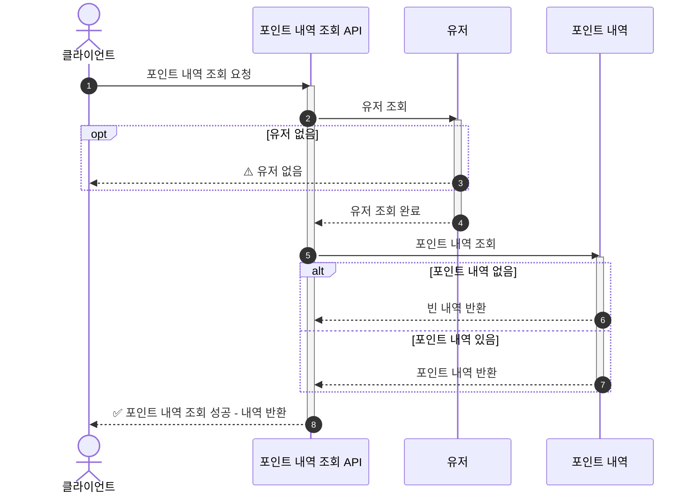
```mermaid
sequenceDiagram
    autonumber
    actor client as 클라이언트
    participant api as 포인트 내역 조회 API
    participant user as 유저
    participant history as 포인트 내역
    
    client->>api: 포인트 내역 조회 요청
    activate api
    
    api->>user: 유저 조회
    activate user
    opt 유저 없음
        user-->>client: ⚠️ 유저 없음
    end
    user-->>api: 유저 조회 완료
    deactivate user
    
    api->>history: 포인트 내역 조회
    activate history
    alt 포인트 내역 없음
        history-->>api: 빈 내역 반환
    else 포인트 내역 있음
        history-->>api: 포인트 내역 반환
        deactivate history  
    end
    
    api-->>client: ✅ 포인트 내역 조회 성공 - 내역 반환
    deactivate api
```
#### 📝 설명 (Description)
- (1) 클라이언트가 포인트 내역 조회를 요청한다.
- (2) 유저 조회를 요청한다.
- (3) 유저가 존재하지 않는 경우, 클라이언트에 `⚠️ 유저 없음` 응답을 보낸다.
- (4)-(5) 유저가 존재하는 경우, 포인트 내역 조회한다.
- (6) 포인트 내역이 존재하지 않는 경우, 빈 내역을 반환한다.
- (7) 포인트 내역이 존재하는 경우, 내역을 반환한다.
- (8) 클라이언트에 `✅ 포인트 내역 조회 성공 - 내역 반환`을 알린다.

### 포인트 충전
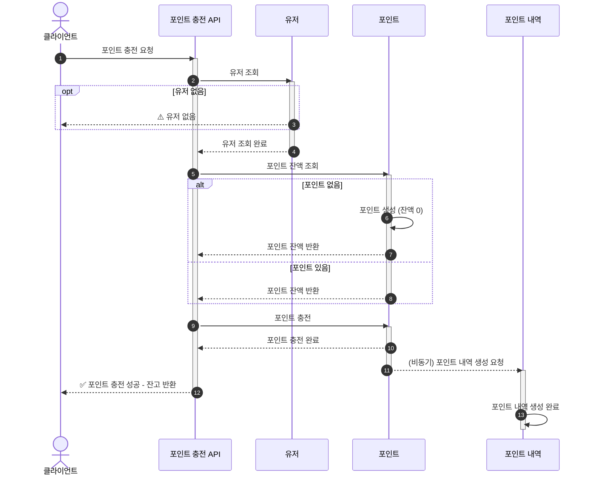
```mermaid
sequenceDiagram
    autonumber
    actor client as 클라이언트
    participant api as 포인트 충전 API
    participant user as 유저
    participant point as 포인트
    participant history as 포인트 내역
    
    client->>api: 포인트 충전 요청
    activate api
    
    api->>user: 유저 조회
    activate user
    opt 유저 없음
        user-->>client: ⚠️ 유저 없음
    end
    user-->>api: 유저 조회 완료
    deactivate user

    api->>point: 포인트 잔액 조회
    activate point
    alt 포인트 없음
        point->>point: 포인트 생성 (잔액 0)
        point-->>api: 포인트 잔액 반환
    else 포인트 있음
        point-->>api: 포인트 잔액 반환
        deactivate point
    end
    
    api->>point: 포인트 충전
    activate point
    point-->>api: 포인트 충전 완료
    point-->>history: (비동기) 포인트 내역 생성 요청
    activate history
    deactivate point
    api-->>client: ✅ 포인트 충전 성공 - 잔고 반환
    deactivate api
    history->>history: 포인트 내역 생성 완료
    deactivate history
```
#### 📝 설명 (Description)
- (1) 클라이언트가 포인트 충전을 요청한다.
- (2) 유저 조회를 요청한다.
- (3) 유저가 존재하지 않는 경우, 클라이언트에 `⚠️ 유저 없음` 응답을 보낸다.
- (4)-(5) 유저가 존재하는 경우, 포인트 잔액 조회한다.
- (6)-(7) 포인트가 존재하지 않는 경우, 포인트를 생성하고 잔액 0을 반환한다.
- (8) 포인트가 존재하는 경우, 잔액을 반환한다.
- (9) 포인트 충전한다.
- (10)-(12) 포인트 충전이 완료되면 `(비동기)`로 포인트 내역 생성을 요청하고 클라이언트에 `✅ 포인트 충전 성공 - 잔고 반환`을 알린다.

## 🏷️ 브랜드 (Brands)
### 브랜드 등록
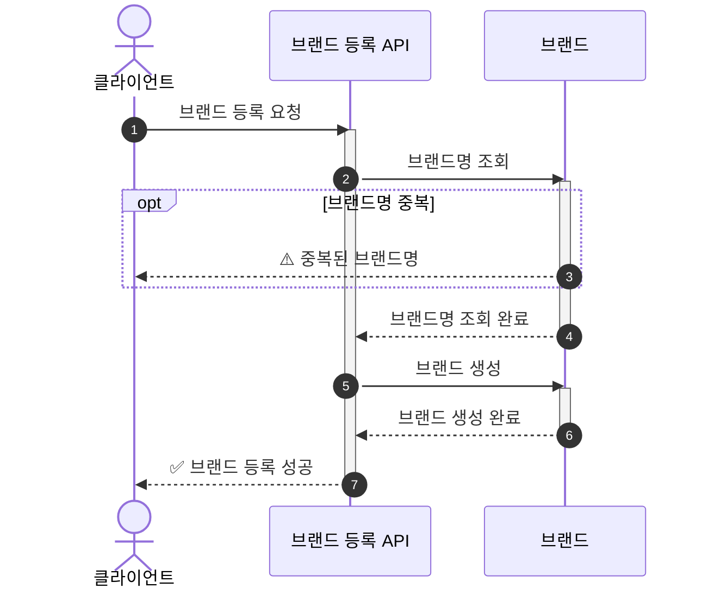
```mermaid
sequenceDiagram
    autonumber
    actor client as 클라이언트
    participant api as 브랜드 등록 API
    participant brand as 브랜드
    
    client->>api: 브랜드 등록 요청
    activate api
    
    api->>brand: 브랜드명 조회
    activate brand
    opt 브랜드명 중복
        brand-->>client: ⚠️ 중복된 브랜드명
    end
    brand-->>api: 브랜드명 조회 완료
    deactivate brand
    
    api->>brand: 브랜드 생성
    activate brand
    brand-->>api: 브랜드 생성 완료
    deactivate brand
    
    api-->>client: ✅ 브랜드 등록 성공
    deactivate api
```
#### 📝 설명 (Description)
- (1) 클라이언트가 브랜드 등록을 요청한다.
- (2) 브랜드 조회한다.
- (3) 브랜드명이 중복되는 경우, 클라이언트에 `⚠️ 중복된 브랜드명` 응답을 보낸다.
- (4)-(7) 브랜드명이 중복되지 않는 경우, 브랜드 생성하고, 완료되면 클라이언트에 `✅ 브랜드 등록 성공`을 알린다.

### 브랜드 상세 조회

```mermaid
sequenceDiagram
    autonumber
    actor client as 클라이언트
    participant api as 브랜드 상세 조회 API
    participant brand as 브랜드
    
    client->>api: 브랜드 상세 조회 요청
    activate api
    
    alt 상품 미포함 요청
        api->>brand: 브랜드 조회
        activate brand
    else 상품 포함 요청
        api->>brand: 브랜드&상품 조회
    end
    
    alt 브랜드 없음
        brand-->>api: 브랜드 없음
    else 브랜드 있음
        brand-->>api: 브랜드 상세 정보
        deactivate brand
    end    
    
    api-->>client: ✅ 브랜드 상세 조회 성공 - 정보 반환
    deactivate api
```
#### 📝 설명 (Description)
- (1) 클라이언트가 브랜드 상세 조회를 요청한다.
- (2) 상품 미포함 요청인 경우, 브랜드 조회한다.
- (3) 상품 포함 요청인 경우, 브랜드&상품 조회한다.
- (4) 브랜드가 존재하지 않는 경우, 브랜드 없음을 반환한다.
- (5) 브랜드가 존재하는 경우, 브랜드 상세 정보를 반환한다.
- (6) 클라이언트에 `✅ 브랜드 상세 조회 성공 - 정보 반환`을 알린다.

## 🛍️ 상품 (Products)
### 상품 등록
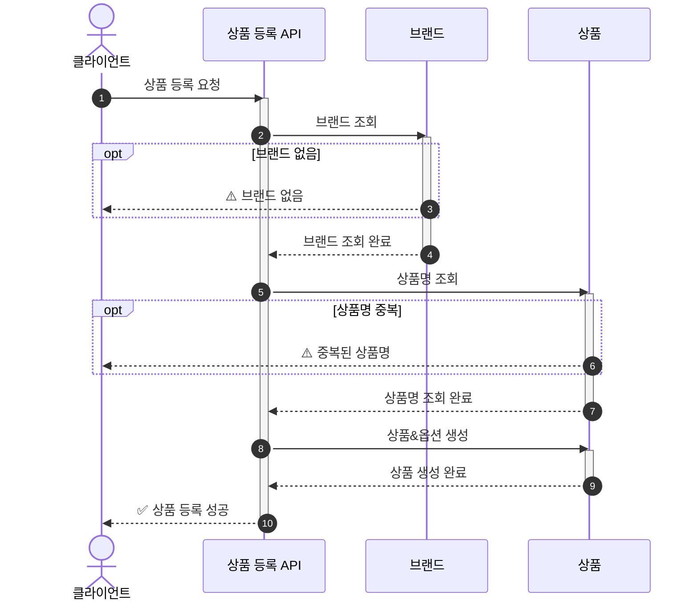
```mermaid
sequenceDiagram
    autonumber
    actor client as 클라이언트
    participant api as 상품 등록 API
    participant brand as 브랜드
    participant product as 상품
    
    client->>api: 상품 등록 요청
    activate api
    
    api->>brand: 브랜드 조회
    activate brand
    opt 브랜드 없음
        brand-->>client: ⚠️ 브랜드 없음
    end
    brand-->>api: 브랜드 조회 완료
    deactivate brand
    
    api->>product: 상품명 조회
    activate product
    opt 상품명 중복
        product-->>client: ⚠️ 중복된 상품명
    end
    product-->>api: 상품명 조회 완료
    deactivate product

    api->>product: 상품&옵션 생성
    activate product
    product-->>api: 상품 생성 완료
    deactivate product
        
    api-->>client: ✅ 상품 등록 성공
    deactivate api
```
#### 📝 설명 (Description)
- (1) 클라이언트가 상품 등록을 요청한다.
- (2) 브랜드 조회를 요청한다.
- (3) 브랜드가 존재하지 않는 경우, 클라이언트에 `⚠️ 브랜드 없음` 응답을 보낸다.
- (4)-(5) 브랜드가 존재하는 경우, 상품명 조회를 요청한다.
- (6) 상품명이 중복되는 경우, 클라이언트에 `⚠️ 중복된 상품명` 응답을 보낸다.
- (7)-(10) 상품명이 중복되지 않는 경우, 상품&상품 옵션을 생성하고, 완료되면 클라이언트에 `✅ 상품 등록 성공`을 알린다.

### 상품 목록 조회
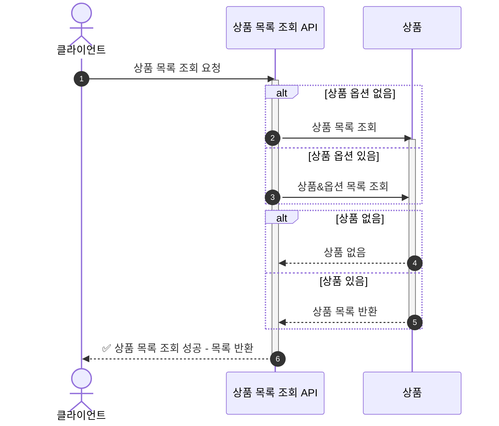
```mermaid
sequenceDiagram
    autonumber
    actor client as 클라이언트
    participant api as 상품 목록 조회 API
    participant product as 상품

    client->>api: 상품 목록 조회 요청
    activate api
    alt 상품 옵션 없음
        api->>product: 상품 목록 조회
        activate product
    else 상품 옵션 있음
        api->>product: 상품&옵션 목록 조회
    end
        
    alt 상품 없음
        product-->>api: 상품 없음
    else 상품 있음
        product-->>api: 상품 목록 반환
        deactivate product
    end
        
    api-->>client: ✅ 상품 목록 조회 성공 - 목록 반환
    deactivate api
```
#### 📝 설명 (Description)
- (1) 클라이언트가 상품 목록 조회를 요청한다.
- (2) 상품 옵션 없음인 경우, 상품 목록 조회를 요청한다.
- (3) 상품 옵션 있음인 경우, 상품&옵션 목록 조회를 요청한다.
- (4) 상품이 존재하지 않는 경우, 상품 없음을 반환한다.
- (5) 상품이 존재하는 경우, 상품 목록을 반환한다.
- (6) 클라이언트에 `✅ 상품 목록 조회 성공 - 목록 반환`을 알린다.

### 상품 상세 조회

```mermaid
sequenceDiagram
    autonumber
    actor client as 클라이언트
    participant api as 상품 상세 조회 API
    participant product as 상품

    client->>api: 상품 상세 조회 요청
    activate api
    alt 상품 옵션 없음
        api->>product: 상품 상세 조회
        activate product
    else 상품 옵션 있음
        api->>product: 상품&옵션 상세 조회
    end
        
    alt 상품 없음
        product-->>api: 상품 없음
    else 상품 있음
        product-->>api: 상품 상세 정보 반환
        deactivate product
    end
        
    api-->>client: ✅ 상품 상세 조회 성공 - 정보 반환
    deactivate api
```
#### 📝 설명 (Description)
- (1) 클라이언트가 상품 상세 조회를 요청한다.
- (2) 상품 옵션 없음인 경우, 상품 상세 조회를 요청한다.
- (3) 상품 옵션 있음인 경우, 상품&옵션 상세 조회를 요청한다
- (4) 상품이 존재하지 않는 경우, 상품 없음을 반환한다.
- (5) 상품이 존재하는 경우, 상품 상세 정보를 반환한다.
- (6) 클라이언트에 `✅ 상품 상세 조회 성공 - 정보 반환`을 알린다.

## ❤️ 좋아요 (Like)
### 좋아요 등록

```mermaid
sequenceDiagram
    autonumber
    actor client as 클라이언트
    participant api as 좋아요 등록 API
    participant user as 유저
    participant product as 상품
    participant like as 좋아요

    client->>api: 좋아요 등록 요청
    activate api

    api->>user: 유저 조회
    activate user
    opt 유저 없음
        user-->>client: ⚠️ 유저 없음
    end
    user-->>api: 유저 조회 완료
    deactivate user

    api->>product: 상품 조회
    activate product
    opt 상품 없음
        product-->>client: ⚠️ 상품 없음
    end
    product-->>api: 상품 조회 완료
    deactivate product

    api->>like: 좋아요 등록
    activate like
    alt 좋아요 된 상품
        like-->>api: 미 변경 (멱등)
    else 좋아요 안된 상품
        like-->>api: 좋아요 등록 완료
        deactivate like
    end
    
    api-->>client: ✅ 좋아요 등록 성공 - 총 좋아요 수 반환
    deactivate api
```
#### 📝 설명 (Description)
- (1) 클라이언트가 좋아요 등록을 요청한다.
- (2) 유저 조회한다.
- (3) 유저가 존재하지 않는 경우, 클라이언트에 `⚠️ 유저 없음` 응답을 보낸다.
- (4)-(5) 유저가 존재하는 경우, 상품 조회한다.
- (6) 상품이 존재하지 않는 경우, 클라이언트에 `⚠️ 상품 없음` 응답을 보낸다.
- (7)-(8) 상품이 존재하는 경우, 좋아요 조회한다.
- (9) 이미 좋아요가 된 상품인 경우, 미 변경(멱등)한다.
- (10)-(11) 좋아요가 안된 상품인 경우, 좋아요 등록하고, 완료되면 클라이언트에 `✅ 좋아요 등록 성공 - 총 좋아요 수 반환`을 알린다.

### 좋아요 취소
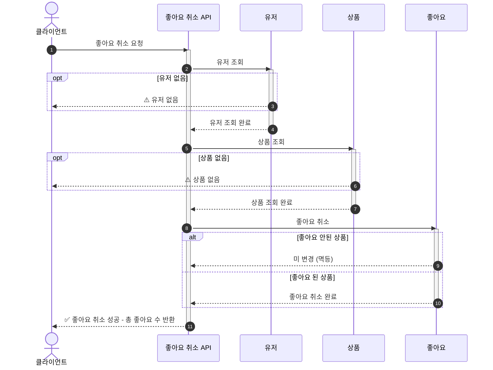
```mermaid
sequenceDiagram
    autonumber
    actor client as 클라이언트
    participant api as 좋아요 취소 API
    participant user as 유저
    participant product as 상품
    participant like as 좋아요

    client->>api: 좋아요 취소 요청
    activate api

    api->>user: 유저 조회
    activate user
    opt 유저 없음
        user-->>client: ⚠️ 유저 없음
    end
    user-->>api: 유저 조회 완료
    deactivate user

    api->>product: 상품 조회
    activate product
    opt 상품 없음
        product-->>client: ⚠️ 상품 없음
    end
    product-->>api: 상품 조회 완료
    deactivate product

    api->>like: 좋아요 취소
    activate like
    alt 좋아요 안된 상품
        like-->>api: 미 변경 (멱등)
    else 좋아요 된 상품
        like-->>api: 좋아요 취소 완료
        deactivate like
    end
    
    api-->>client: ✅ 좋아요 취소 성공 - 총 좋아요 수 반환
    deactivate api
```
#### 📝 설명 (Description)
- (1) 클라이언트가 좋아요 취소를 요청한다.
- (2) 유저 조회한다.
- (3) 유저가 존재하지 않는 경우, 클라이언트에 `⚠️ 유저 없음` 응답을 보낸다.
- (4)-(5) 유저가 존재하는 경우, 상품 조회한다.
- (6) 상품이 존재하지 않는 경우, 클라이언트에 `⚠️ 상품 없음` 응답을 보낸다.
- (7)-(8) 상품이 존재하는 경우, 좋아요 조회한다.
- (9) 좋아요가 안된 상품인 경우, 미 변경(멱등)한다.
- (10)-(11) 좋아요가 된 상품인 경우, 좋아요 취소하고, 완료되면 클라이언트에 `✅ 좋아요 취소 성공 - 총 좋아요 수 반환`을 알린다.

### 내가 좋아요한 상품 목록 조회
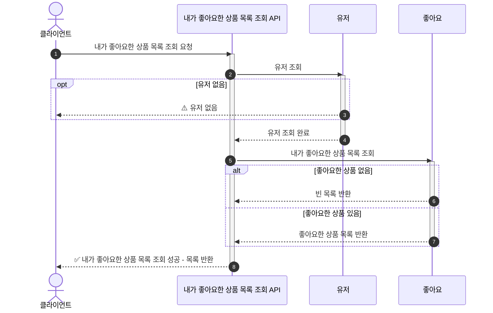
```mermaid
sequenceDiagram
    autonumber
    actor client as 클라이언트
    participant api as 내가 좋아요한 상품 목록 조회 API
    participant user as 유저
    participant like as 좋아요

    client->>api: 내가 좋아요한 상품 목록 조회 요청
    activate api

    api->>user: 유저 조회
    activate user
    opt 유저 없음
        user-->>client: ⚠️ 유저 없음
    end
    user-->>api: 유저 조회 완료
    deactivate user

    api->>like: 내가 좋아요한 상품 목록 조회
    activate like
    alt 좋아요한 상품 없음
        like-->>api: 빈 목록 반환
    else 좋아요한 상품 있음
        like-->>api: 좋아요한 상품 목록 반환
        deactivate like
    end
    
    api-->>client: ✅ 내가 좋아요한 상품 목록 조회 성공 - 목록 반환
    deactivate api
```
#### 📝 설명 (Description)
- (1) 클라이언트가 내가 좋아요한 상품 목록 조회를 요청한다.
- (2) 유저 조회한다.
- (3) 유저가 존재하지 않는 경우, 클라이언트에 `⚠️ 유저 없음` 응답을 보낸다.
- (4)-(5) 유저가 존재하는 경우, 내가 좋아요한 상품 목록 조회한다.
- (6) 좋아요한 상품이 존재하지 않는 경우, 빈 목록을 반환한다.
- (7)-8) 좋아요한 상품이 존재하는 경우, 좋아요한 상품 목록을 반환한다.
- (9) 클라이언트에 `✅ 내가 좋아요한 상품 목록 조회 성공 - 목록 반환`을 알린다.

## 🧾 주문 / 결재 (Orders & Payments)
### 주문 요청
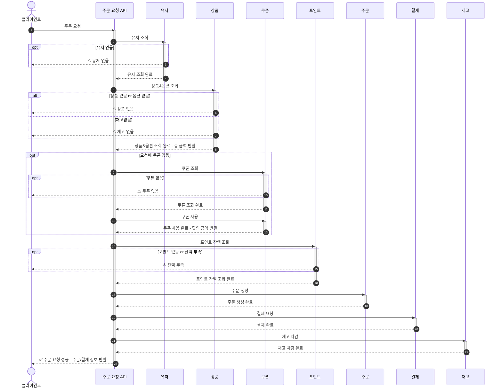
```mermaid
sequenceDiagram
    autonumber
    actor client as 클라이언트
    participant api as 주문 요청 API
    participant user as 유저
    participant product as 상품
    participant coupon as 쿠폰
    participant point as 포인트
    participant order as 주문
    participant payment as 결제
    participant inventory as 재고

    client->>api: 주문 요청
    activate api

    api->>user: 유저 조회
    activate user
    opt 유저 없음
        user-->>client: ⚠️ 유저 없음
    end
    user-->>api: 유저 조회 완료
    deactivate user

    api->>product: 상품&옵션 조회
    activate product
    alt 상품 없음 or 옵션 없음
        product-->>client: ⚠️ 상품 없음
    else 재고없음
        product-->>client: ⚠️ 재고 없음
    end
    
    product-->>api: 상품&옵션 조회 완료 - 총 금액 반환
    deactivate product
    
    opt 요청에 쿠폰 있음
        api->>coupon: 쿠폰 조회
        activate coupon
        opt 쿠폰 없음
            coupon-->>client: ⚠️ 쿠폰 없음
        end
        coupon-->>api: 쿠폰 조회 완료
        deactivate coupon
        api->>coupon: 쿠폰 사용
        activate coupon
        coupon-->>api: 쿠폰 사용 완료 - 할인 금액 반환
        deactivate coupon
    end
    
    api->>point: 포인트 잔액 조회
    activate point
    opt 포인트 없음 or 잔액 부족
        point-->>client: ⚠️ 잔액 부족
    end
    point-->>api: 포인트 잔액 조회 완료
    deactivate point

    api->>order: 주문 생성
    activate order
    order-->>api: 주문 생성 완료
    deactivate order

    api->>payment: 결제 요청
    activate payment
    payment-->>api: 결제 완료
    deactivate payment
    
    api->>inventory: 재고 차감
    activate inventory
    inventory-->>api: 재고 차감 완료
    deactivate inventory
    
    api-->>client: ✅ 주문 요청 성공 - 주문/결제 정보 반환
    deactivate api
```
#### 📝 설명 (Description)
- (1) 클라이언트가 주문 요청을 한다.
- (2) 유저 조회한다.
- (3) 유저가 존재하지 않는 경우, 클라이언트에 `⚠️ 유저 없음` 응답을 보낸다.
- (4)-(5) 유저가 존재하는 경우, 상품&옵션 조회한다.
- (6) 상품이 존재하지 않거나 옵션이 존재하지 않는 경우, 클라이언트에 `⚠️ 상품 없음` 응답을 보낸다.
- (7) 재고가 없는 경우, 클라이언트에 `⚠️ 재고 없음` 응답을 보낸다.
- (8) 상품&옵션 조회가 완료되면 총 금액을 반환한다.
- (9) 요청에 쿠폰이 있는 경우, 쿠폰 조회한다.
- (10) 쿠폰이 존재하지 않는 경우, 클라이언트에 `⚠️ 쿠폰 없음` 응답을 보낸다.
- (11)-(13) 쿠폰이 존재하는 경우, 쿠폰 사용하고 할인 금액을 반환한다.
- (14) 포인트 잔액 조회한다.
- (15) 포인트가 존재하지 않거나 잔액이 부족한 경우, 클라이언트에 `⚠️ 잔액 부족` 응답을 보낸다.
- (16)-(17) 포인트 잔액 조회가 완료되면, 주문 생성한다.
- (18)-(19) 주문 생성이 완료되면, 결제 요청한다.
- (20)-(21) 결제가 완료되면, 재고 차감한다.
- (22)-(23) 재고 차감이 완료되면, 클라이언트에 `✅ 주문 요청 성공 - 주문/결제 정보 반환`을 알린다.

### 주문 목록 조회
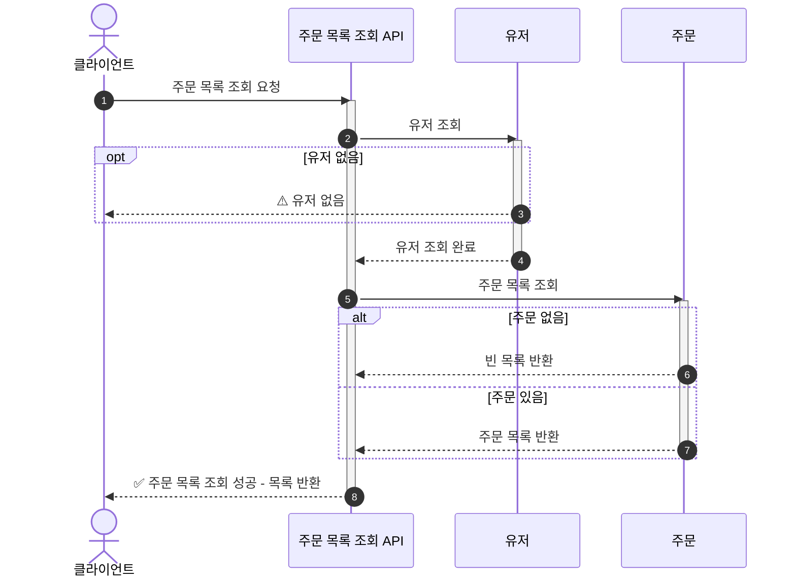
```mermaid
sequenceDiagram
    autonumber
    actor client as 클라이언트
    participant api as 주문 목록 조회 API
    participant user as 유저
    participant order as 주문

    client->>api: 주문 목록 조회 요청
    activate api

    api->>user: 유저 조회
    activate user
    opt 유저 없음
        user-->>client: ⚠️ 유저 없음
    end
    user-->>api: 유저 조회 완료
    deactivate user

    api->>order: 주문 목록 조회
    activate order
    alt 주문 없음
        order-->>api: 빈 목록 반환
    else 주문 있음
        order-->>api: 주문 목록 반환
        deactivate order
    end
    
    api-->>client: ✅ 주문 목록 조회 성공 - 목록 반환
    deactivate api
```
#### 📝 설명 (Description)
- (1) 클라이언트가 주문 목록 조회를 요청한다.
- (2) 유저 조회한다.
- (3) 유저가 존재하지 않는 경우, 클라이언트에 `⚠️ 유저 없음` 응답을 보낸다.
- (4)-(5) 유저가 존재하는 경우, 주문 목록 조회한다.
- (6) 주문이 존재하지 않는 경우, 빈 목록을 반환한다.
- (7) 주문이 존재하는 경우, 주문 목록을 반환한다.
- (8) 클라이언트에 `✅ 주문 목록 조회 성공 - 목록 반환`을 알린다.

### 주문 상세 조회
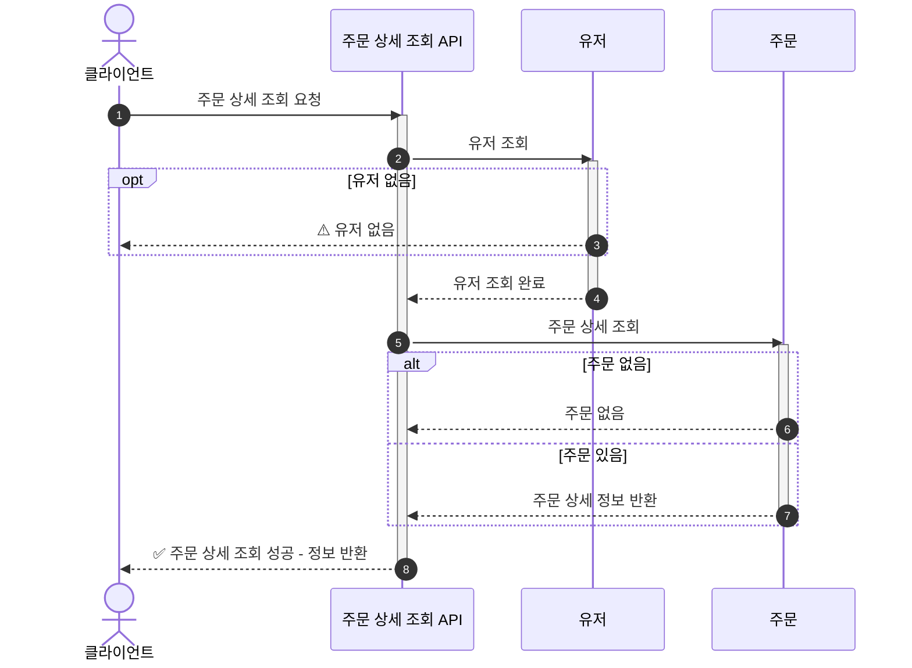
```mermaid
sequenceDiagram
    autonumber
    actor client as 클라이언트
    participant api as 주문 상세 조회 API
    participant user as 유저
    participant order as 주문

    client->>api: 주문 상세 조회 요청
    activate api

    api->>user: 유저 조회
    activate user
    opt 유저 없음
        user-->>client: ⚠️ 유저 없음
    end
    user-->>api: 유저 조회 완료
    deactivate user

    api->>order: 주문 상세 조회
    activate order
    alt 주문 없음
        order-->>api: 주문 없음
    else 주문 있음
        order-->>api: 주문 상세 정보 반환
        deactivate order
    end
    
    api-->>client: ✅ 주문 상세 조회 성공 - 정보 반환
    deactivate api
```
#### 📝 설명 (Description)
- (1) 클라이언트가 주문 상세 조회를 요청한다.
- (2) 유저 조회한다.
- (3) 유저가 존재하지 않는 경우, 클라이언트에 `⚠️ 유저 없음` 응답을 보낸다.
- (4)-(5) 유저가 존재하는 경우, 주문 상세 조회한다.
- (6) 주문이 존재하지 않는 경우, 주문 없음을 반환한다.
- (7) 주문이 존재하는 경우, 주문 상세 정보를 반환한다.
- (8) 클라이언트에 `✅ 주문 상세 조회 성공 - 정보 반환`을 알린다.

## 🛒 장바구니 (Cart)
### 장바구니 추가
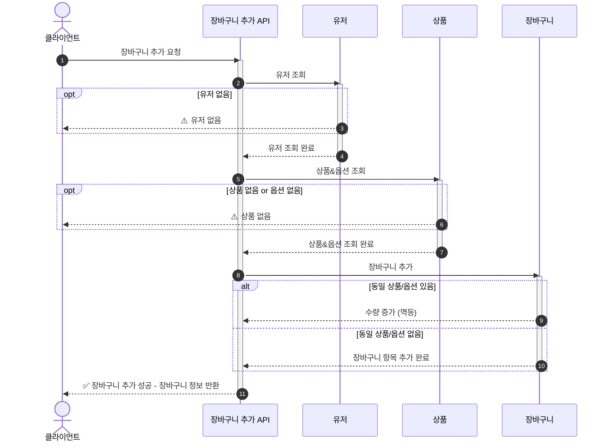
```mermaid
sequenceDiagram
    autonumber
    actor client as 클라이언트
    participant api as 장바구니 추가 API
    participant user as 유저
    participant product as 상품
    participant cart as 장바구니

    client->>api: 장바구니 추가 요청
    activate api

    api->>user: 유저 조회
    activate user
    opt 유저 없음
        user-->>client: ⚠️ 유저 없음
    end
    user-->>api: 유저 조회 완료
    deactivate user

    api->>product: 상품&옵션 조회
    activate product
    opt 상품 없음 or 옵션 없음
        product-->>client: ⚠️ 상품 없음
    end
    product-->>api: 상품&옵션 조회 완료
    deactivate product

    api->>cart: 장바구니 추가
    activate cart
    alt 동일 상품/옵션 있음
        cart-->>api: 수량 증가 (멱등)
    else 동일 상품/옵션 없음
        cart-->>api: 장바구니 항목 추가 완료
        deactivate cart
    end
    
    api-->>client: ✅ 장바구니 추가 성공 - 장바구니 정보 반환
    deactivate api
```
#### 📝 설명 (Description)
- (1) 클라이언트가 장바구니 추가를 요청한다.
- (2) 유저 조회한다.
- (3) 유저가 존재하지 않는 경우, 클라이언트에 `⚠️ 유저 없음` 응답을 보낸다.
- (4)-(5) 유저가 존재하는 경우, 상품&옵션 조회한다.
- (6) 상품이 존재하지 않거나 옵션이 존재하지 않는 경우, 클라이언트에 `⚠️ 상품 없음` 응답을 보낸다.
- (7)-(8) 상품&옵션 조회가 완료되면, 장바구니 추가한다.
- (9) 동일 상품/옵션이 이미 있는 경우, 수량 증가(멱등)한다.
- (10) 동일 상품/옵션이 없는 경우, 장바구니 항목을 추가한다.
- (11) 클라이언트에 `✅ 장바구니 추가 성공 - 장바구니 정보 반환`을 알린다.

### 장바구니 조회
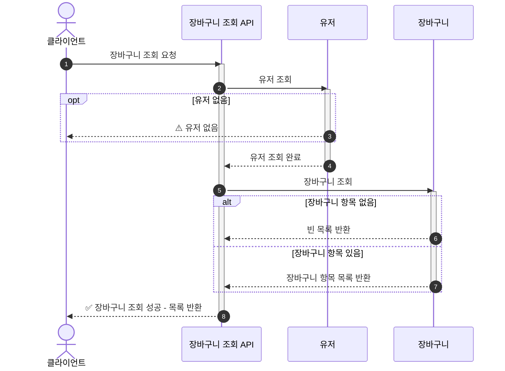
```mermaid
sequenceDiagram
    autonumber
    actor client as 클라이언트
    participant api as 장바구니 조회 API
    participant user as 유저
    participant cart as 장바구니

    client->>api: 장바구니 조회 요청
    activate api

    api->>user: 유저 조회
    activate user
    opt 유저 없음
        user-->>client: ⚠️ 유저 없음
    end
    user-->>api: 유저 조회 완료
    deactivate user

    api->>cart: 장바구니 조회
    activate cart
    alt 장바구니 항목 없음
        cart-->>api: 빈 목록 반환
    else 장바구니 항목 있음
        cart-->>api: 장바구니 항목 목록 반환
        deactivate cart
    end
    
    api-->>client: ✅ 장바구니 조회 성공 - 목록 반환
    deactivate api
```
#### 📝 설명 (Description)
- (1) 클라이언트가 장바구니 조회를 요청한다.
- (2) 유저 조회한다.
- (3) 유저가 존재하지 않는 경우, 클라이언트에 `⚠️ 유저 없음` 응답을 보낸다.
- (4)-(5) 유저가 존재하는 경우, 장바구니 조회한다.
- (6) 장바구니 항목이 존재하지 않는 경우, 빈 목록을 반환한다.
- (7) 장바구니 항목이 존재하는 경우, 장바구니 항목 목록을 반환한다.
- (8) 클라이언트에 `✅ 장바구니 조회 성공 - 목록 반환`을 알린다.

### 장바구니 수정
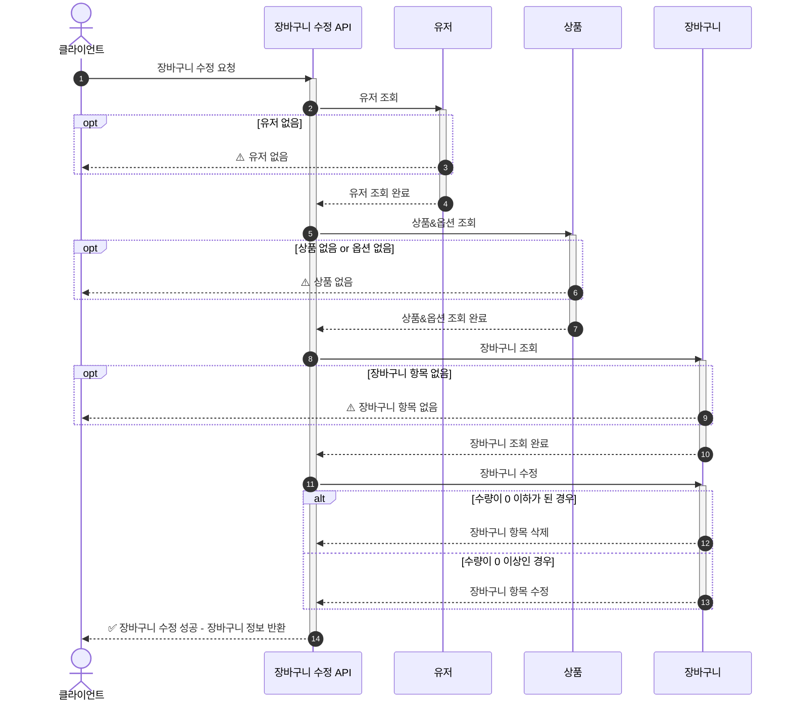
```mermaid
sequenceDiagram
    autonumber
    actor client as 클라이언트
    participant api as 장바구니 수정 API
    participant user as 유저
    participant product as 상품
    participant cart as 장바구니

    client->>api: 장바구니 수정 요청
    activate api

    api->>user: 유저 조회
    activate user
    opt 유저 없음
        user-->>client: ⚠️ 유저 없음
    end
    user-->>api: 유저 조회 완료
    deactivate user

    api->>product: 상품&옵션 조회
    activate product
    opt 상품 없음 or 옵션 없음
        product-->>client: ⚠️ 상품 없음
    end
    product-->>api: 상품&옵션 조회 완료
    deactivate product

    api->>cart: 장바구니 조회
    activate cart
    opt 장바구니 항목 없음
        cart-->>client: ⚠️ 장바구니 항목 없음
    end
    cart-->>api: 장바구니 조회 완료
    deactivate cart
    
    api->>cart: 장바구니 수정
    activate cart
    alt 수량이 0 이하가 된 경우
        cart-->>api: 장바구니 항목 삭제
    else 수량이 0 이상인 경우
        cart-->>api: 장바구니 항목 수정
        deactivate cart
    end
    
    api-->>client: ✅ 장바구니 수정 성공 - 장바구니 정보 반환
    deactivate api
```
#### 📝 설명 (Description)
- (1) 클라이언트가 장바구니 수정을 요청한다.
- (2) 유저 조회한다.
- (3) 유저가 존재하지 않는 경우, 클라이언트에 `⚠️ 유저 없음` 응답을 보낸다.
- (4)-(5) 유저가 존재하는 경우, 상품&옵션 조회한다.
- (6) 상품이 존재하지 않거나 옵션이 존재하지 않는 경우, 클라이언트에 `⚠️ 상품 없음` 응답을 보낸다.
- (7)-(8) 상품&옵션 조회가 완료되면, 장바구니 조회한다.
- (9) 장바구니 항목이 존재하지 않는 경우, 클라이언트에 `⚠️ 장바구니 항목 없음` 응답을 보낸다.
- (10)-(11) 장바구니 항목이 존재하는 경우, 장바구니 수정한다.
- (12) 수정 후 수량이 0 이하가 된 경우, 장바구니 항목을 삭제한다.
- (13) 수정 후 수량이 0 이상인 경우, 장바구니 항목을 수정한다.
- (14) 클라이언트에 `✅ 장바구니 수정 성공 - 장바구니 정보 반환`을 알린다.

### 장바구니 삭제
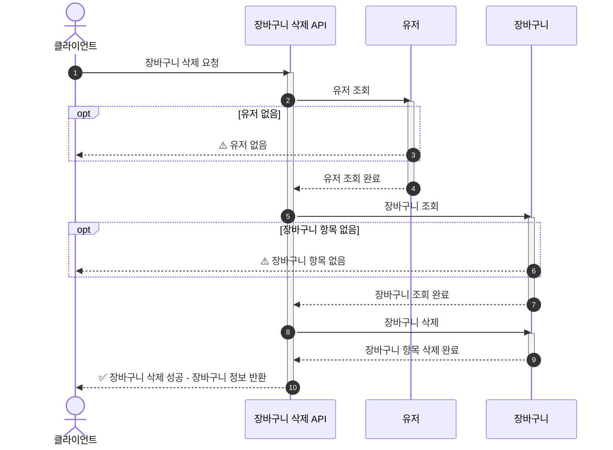
```mermaid
sequenceDiagram
    autonumber
    actor client as 클라이언트
    participant api as 장바구니 삭제 API
    participant user as 유저
    participant cart as 장바구니

    client->>api: 장바구니 삭제 요청
    activate api

    api->>user: 유저 조회
    activate user
    opt 유저 없음
        user-->>client: ⚠️ 유저 없음
    end
    user-->>api: 유저 조회 완료
    deactivate user

    api->>cart: 장바구니 조회
    activate cart
    opt 장바구니 항목 없음
        cart-->>client: ⚠️ 장바구니 항목 없음
    end
    cart-->>api: 장바구니 조회 완료
    deactivate cart
    
    api->>cart: 장바구니 삭제
    activate cart
    cart-->>api: 장바구니 항목 삭제 완료
    deactivate cart
    
    api-->>client: ✅ 장바구니 삭제 성공 - 장바구니 정보 반환
    deactivate api
```
#### 📝 설명 (Description)
- (1) 클라이언트가 장바구니 삭제를 요청한다.
- (2) 유저 조회한다.
- (3) 유저가 존재하지 않는 경우, 클라이언트에 `⚠️ 유저 없음` 응답을 보낸다.
- (4)-(5) 유저가 존재하는 경우, 장바구니 조회한다.
- (6) 장바구니 항목이 존재하지 않는 경우, 클라이언트에 `⚠️ 장바구니 항목 없음` 응답을 보낸다.
- (7)-(8) 장바구니 항목이 존재하는 경우, 장바구니 삭제한다.
- (9)-(10) 장바구니 항목 삭제가 완료되면, 클라이언트에 `✅ 장바구니 삭제 성공 - 장바구니 정보 반환`을 알린다.

## 🎟️ 쿠폰 (Coupons)
### 쿠폰 발급
```mermaid
sequenceDiagram
    autonumber
    actor client as 클라이언트
    participant api as 쿠폰 발급 API
    participant user as 유저
    participant coupon as 쿠폰

    client->>api: 쿠폰 발급 요청
    activate api

    api->>user: 유저 조회
    activate user
    opt 유저 없음
        user-->>client: ⚠️ 유저 없음
    end
    user-->>api: 유저 조회 완료
    deactivate user
    
    api->>coupon: 쿠폰 조회
    activate coupon
    alt 쿠폰 없음
        coupon-->>client: ⚠️ 쿠폰 종류 없음
    else 쿠폰 없음
        coupon-->>client: ⚠️ 쿠폰 재고 없음
    end
    coupon-->>api: 쿠폰 조회 완료
    deactivate coupon
    
    api->>coupon: 유저 쿠폰 조회
    activate coupon
    opt 이미 발급된 쿠폰 있음
        coupon-->>client: ⚠️ 이미 발급된 쿠폰
    end
    coupon-->>api: 유저 쿠폰 조회 완료
    deactivate coupon

    api->>coupon: 쿠폰 발급
    activate coupon
    coupon-->>api: 쿠폰 발급 완료
    deactivate coupon
    
    api-->>client: ✅ 쿠폰 발급 성공 - 쿠폰 정보 반환
    deactivate api
```
#### 📝 설명 (Description)
- (1) 클라이언트가 쿠폰 발급을 요청한다.
- (2) 유저 조회한다.
- (3) 유저가 존재하지 않는 경우, 클라이언트에 `⚠️ 유저 없음` 응답을 보낸다.
- (4)-(5) 유저가 존재하는 경우, 쿠폰 조회한다.
- (6) 쿠폰 종류가 존재하지 않는 경우, 클라이언트에 `⚠️ 쿠폰 종류 없음` 응답을 보낸다.
- (7) 쿠폰 재고가 없는 경우, 클라이언트에 `⚠️ 쿠폰 재고 없음` 응답을 보낸다.
- (8)-(9) 쿠폰이 존재하는 경우, 유저 쿠폰 조회한다.
- (10) 이미 발급된 쿠폰이 존재하는 경우, 클라이언트에 `⚠️ 이미 발급된 쿠폰` 응답을 보낸다.
- (11)-(12) 발급 가능한 쿠폰이 존재하는 경우, 쿠폰 발급한다.
- (13)-(14) 쿠폰 발급이 완료되면, 클라이언트에 `✅ 쿠폰 발급 성공 - 쿠폰 정보 반환`을 알린다.

### 쿠폰 조회
```mermaid
sequenceDiagram
    autonumber
    actor client as 클라이언트
    participant api as 쿠폰 조회 API
    participant user as 유저
    participant coupon as 쿠폰

    client->>api: 쿠폰 조회 요청
    activate api

    api->>user: 유저 조회
    activate user
    opt 유저 없음
        user-->>client: ⚠️ 유저 없음
    end
    user-->>api: 유저 조회 완료
    deactivate user

    api->>coupon: 쿠폰 조회
    activate coupon
    alt 쿠폰 없음
        coupon-->>api: 빈 목록 반환
    else 쿠폰 있음
        coupon-->>api: 쿠폰 목록 반환
        deactivate coupon
    end
    
    api-->>client: ✅ 쿠폰 조회 성공 - 목록 반환
    deactivate api
```
#### 📝 설명 (Description)
- (1) 클라이언트가 쿠폰 조회를 요청한다.
- (2) 유저 조회한다.
- (3) 유저가 존재하지 않는 경우, 클라이언트에 `⚠️ 유저 없음` 응답을 보낸다.
- (4)-(5) 유저가 존재하는 경우, 쿠폰 조회한다.
- (6) 쿠폰이 존재하지 않는 경우, 빈 목록을 반환한다.
- (7) 쿠폰이 존재하는 경우, 쿠폰 목록을 반환한다.
- (8) 클라이언트에 `✅ 쿠폰 조회 성공 - 목록 반환`을 알린다.
