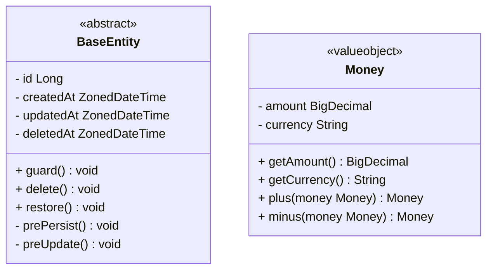
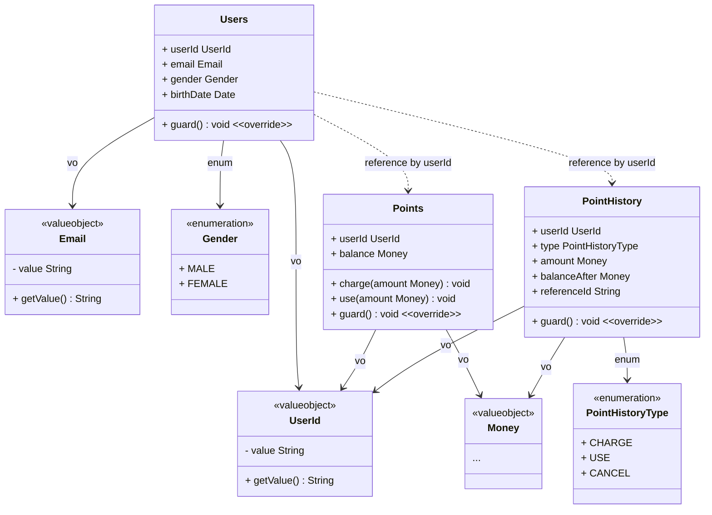
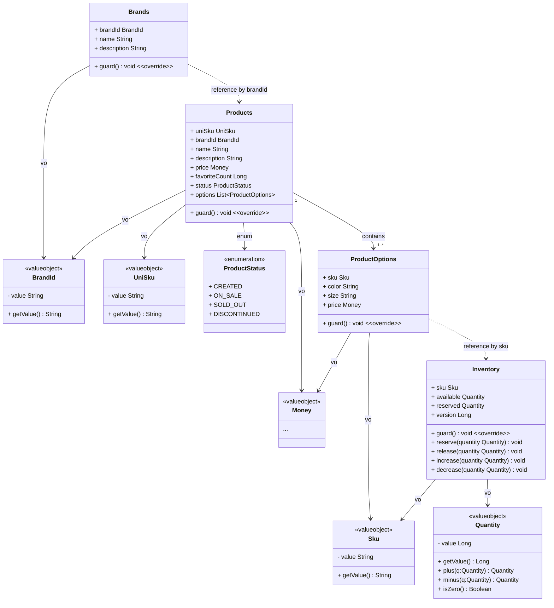
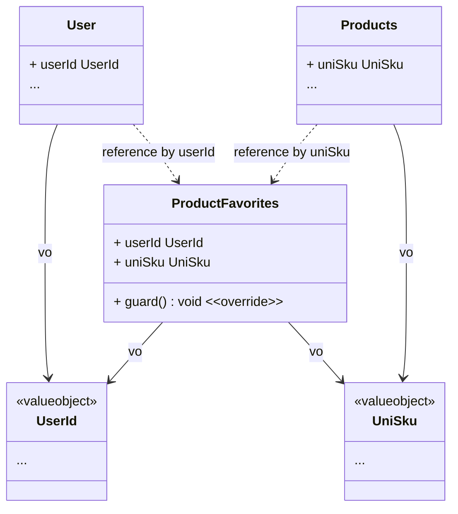
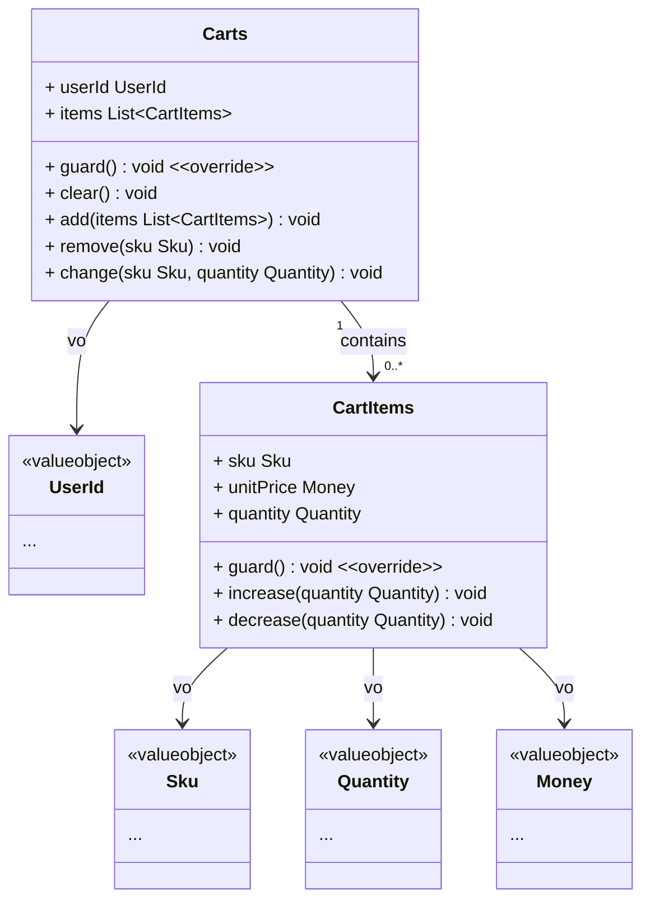
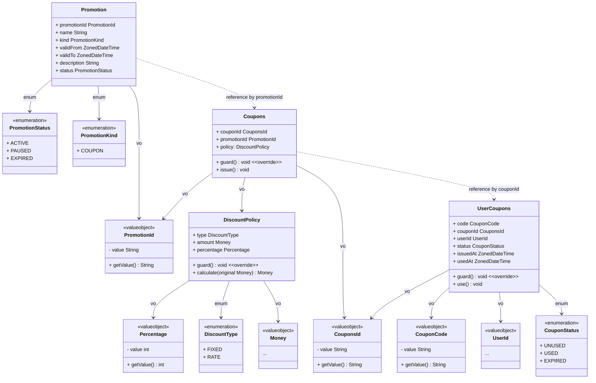

# 🛒 E-Commerce Class Diagram
## ♻️ 공유 커널 (Shared Kernel)

### 🏗️ BaseEntity
- `BaseEntity`는 모든 엔티티가 상속하는 추상 클래스입니다.
- `id`는 각 엔티티의 고유 식별자입니다.
- `createdAt`, `updatedAt`, `deletedAt`는 각각 생성, 수정, 삭제 시각을 나타냅니다.
- `guard()` 메서드는 엔티티의 무결성을 검사합니다.
- `delete()` 메서드는 엔티티를 논리적으로 삭제합니다.
- `restore()` 메서드는 논리적으로 삭제된 엔티티를 복원합니다.
- `prePersist()`와 `preUpdate()` 메서드는 `JPA`의 라이프사이클 콜백 메서드로, 엔티티가 저장되거나 업데이트되기 전에 호출됩니다.

### 💰 Money
- `Money`는 금액과 통화를 나타내는 값 객체입니다.
- `amount`는 금액을 나타내며, `BigDecimal` 타입으로 정의됩니다.
- `currency`는 통화를 나타내며, `String` 타입으로 정의됩니다.
- `getAmount()` 메서드는 금액을 반환합니다.
- `getCurrency()` 메서드는 통화를 반환합니다.
- `plus(money Money)` 메서드는 두 금액을 더한 새로운 `Money` 객체를 반환합니다.
- `minus(money Money)` 메서드는 두 금액을 뺀 새로운 `Money` 객체를 반환합니다.

## 🏷️ 바운디드 컨텍스트 (Bounded Contexts)
### 👤 사용자 BC (Identity Bounded Context)

### 🛍️ 카탈로그 BC (Catalog Bounded Context)

### ❤️ 소셜 BC (Social Bounded Context)

### 🛒 카트 BC (Cart Bounded Context)

### 🧾 커머스 BC (Commerce Bounded Context)

```mermaid
classDiagram
    class OrderNo {
        <<valueobject>>
        - value String
        + getValue() String
    }

    class OrderStatus {
        <<enumeration>>
        + CREATED
        + PENDING
        + COMPLETED
        + CANCELED
    }

    class UserId {
        <<valueobject>>
        ...
    }

    class Money {
        <<valueobject>>
        ...
    }
    
    class Sku {
        <<valueobject>>
        ...
    }
    
    class Quantity {
        <<valueobject>>
        ...
    }

    class PaymentStatus {
        <<enumeration>>
        + REQUESTED
        + SUCCEEDED
        + FAILED
    }

    class Orders {
        + orderNo OrderNo
        + userId UserId
        + items List~OrderItems~
        + productTotal Money
        + discountTotal Money
        + orderTotal Money
        + status OrderStatus
        + guard() void ~~override~~
        + confirm() void
        + cancel() void
    }

    class OrderItems {
        + sku Sku
        + unitPrice Money
        + quantity Quantity
        + guard() void ~~override~~
    }

    class Payments {
        + orderNo OrderNo
        + status PaymentStatus
        + paidAmount Money
        + approvedAt ZonedDateTime
        + guard() void ~~override~~
        + appreove() void
    }
    
    Payments --> OrderNo : vo
    Orders --> OrderNo : vo
    Orders --> OrderStatus : enum
    Payments --> PaymentStatus : enum
    OrderItems --> Money : vo
    Orders --> Money : vo
    Payments --> Money : vo
    Orders --> UserId : vo
    Orders ..> Payments : reference by orderNo
    Orders "1" --> "1..*" OrderItems : contains
    OrderItems --> Sku : vo
    OrderItems --> Quantity : vo
```

### 🎉 프로모션 BC (Promotion Bounded Context)

